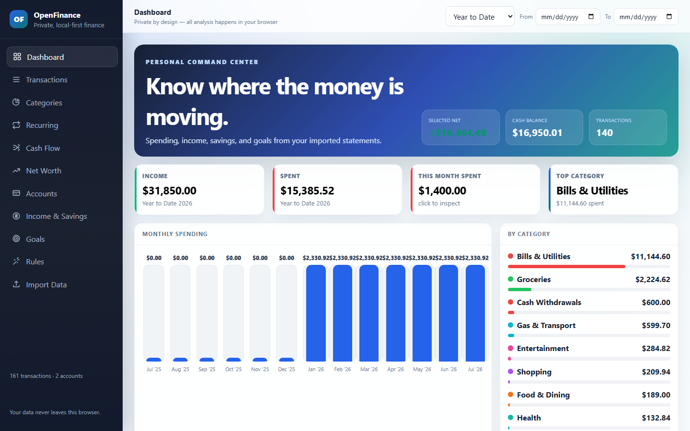
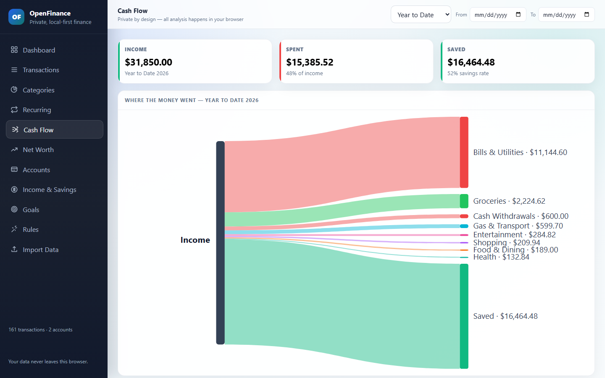

# OpenFinance by Jeffrey Macy

Turn bank CSV exports into a private spending, cash-flow, and net-worth dashboard. OpenFinance does not connect to your bank or require an account; the public application processes imported financial data locally in your browser.

**[Open OpenFinance →](https://finance.jeffreymacy.com/)**
**[Explore with synthetic demo data →](https://finance.jeffreymacy.com/?demo=1)**



## Who it is for

OpenFinance is designed for people who prefer a deliberate monthly financial review over continuous bank synchronization. It is a good fit when you already download transaction CSVs, use spreadsheets, want to inspect several accounts together, or prefer not to grant a finance application ongoing bank access.

It is not a live balance service, bank-reconciliation system, tax-preparation product, investment adviser, or substitute for professional accounting records.

## What it does

- **Dashboard** — monthly spending, category breakdowns, daily activity, and summary cards
- **Transactions** — search, filter, and correct categories
- **Recurring** — identify recurring-transaction candidates from repeated activity
- **Cash Flow** — visualize how imported income moved into spending and savings
- **Net Worth** — display balance history when a compatible export includes balance data
- **Income & Savings** — monthly and year-to-date summaries
- **Goals and Rules** — save spending targets and reusable merchant-category rules locally
- **Business mode** — organize designated business accounts into P&L summaries, invoices, mileage, and estimated tax set-asides
- **Affordability** — explore illustrative housing-payment scenarios
- **Feedback** — prepare a structured question, bug report, or improvement idea for the creator without uploading application data



## Privacy model

For the public deployment at `finance.jeffreymacy.com`:

- CSV parsing happens on your device.
- OpenFinance never asks for bank usernames, passwords, API credentials, or connection tokens.
- Imported CSV contents are stored in this browser's IndexedDB so a previous import can be restored.
- Category changes, goals, rules, and interface preferences may be stored in browser local storage.
- Imported financial data is not transmitted to an OpenFinance application server.
- The application is delivered over the internet and loads interface resources from hosting providers. Ordinary requests for those resources may expose connection metadata such as an IP address; imported financial contents are not included.
- Use **Clear data** in the application, or the browser's site-data controls, to remove locally stored OpenFinance data.
- The **Feedback** page opens a draft in your email application. Only the feedback you enter, the app version, and basic device/browser information are placed in that draft; nothing is sent until you choose to send it.

Read the complete [privacy explanation](https://finance.jeffreymacy.com/privacy/) and [security and accuracy limitations](https://finance.jeffreymacy.com/security/) before using sensitive files.

## Supported CSV structures

The parser contains explicit handling for these currently tested structures:

| Export structure | Detection cues |
| --- | --- |
| Chase credit card | Transaction Date, Post Date, Description, Category, Type, Amount |
| Chase checking | Posting Date plus checking activity fields such as Description, Amount, Type, Balance |
| Apple Card | Merchant and Clearing Date fields plus Transaction Date, Category, Type, Amount (USD) |
| Desert Financial | Transaction ID and Transaction Category fields |
| Elan / First National | Name and Memo fields |
| Generic CSV | Recognizable date plus amount, or date plus separate debit/credit fields |

Bank export formats and menu locations can change. A `.csv` extension alone does not guarantee compatibility. Verify dates, transaction signs, transfers, refunds, balances, categories, and duplicate date ranges against original records. Do not submit real financial data in a bug report; use synthetic rows containing the same column names and data shapes.

Guides:

- [Analyze a Chase CSV privately](https://finance.jeffreymacy.com/guides/chase-csv-spending-analyzer/)
- [Analyze an Apple Card CSV privately](https://finance.jeffreymacy.com/guides/apple-card-csv-spending-analyzer/)
- [Private generic bank CSV analysis](https://finance.jeffreymacy.com/guides/private-bank-statement-analyzer/)

## Browser and desktop options

The browser application works on desktop and mobile without cloning the repository. On supported mobile browsers, use **Add to Home Screen** or **Install app** to install the progressive web app. CSV selection and PWA installation behavior varies by browser and operating system.

A Windows Electron build is also published on the [Releases page](https://github.com/Heavens-Lava/openfinance/releases/latest). The `.exe` installer works only on Windows; it does not install on iPhone, iPad, Android, macOS, or Linux. The installer is not currently code-signed, so Windows SmartScreen may identify it as an unknown publisher. Most people should begin with the browser version; technical users who choose the desktop build should verify that it came from this repository's official release page.

## Run locally

```bash
git clone https://github.com/Heavens-Lava/openfinance
cd openfinance
npm install
npm test
npm run dev
```

Open `http://localhost:5173`, select **Try demo data**, or import a synthetic CSV before testing with personal records.

## Desktop development

```bash
npm run build:app
npm run electron
npm run dist:win
```

The installer is written to `release/OpenFinance-Setup.exe`. A tag matching `v*.*.*` triggers the repository's release workflow.

## Deployment variants

This repository produces two deployments with different storage models:

| Deployment | Data model | Authentication |
| --- | --- | --- |
| `finance.jeffreymacy.com` | Browser-only IndexedDB/localStorage | None |
| Private MacyFinance deployment | Private Supabase Storage | Supabase authentication |

The public OpenFinance build does not create a Supabase client or make cloud-data requests. MacyFinance uses the same interface and finance logic but can load and save CSV imports in a private, user-scoped storage bucket. A private deployment is not covered by the public site's privacy description unless it uses the same configuration.

For a MacyFinance deployment:

1. Set `VITE_APP_VARIANT=macyfinance`.
2. Configure the Supabase URL, public anonymous key, and permitted login email.
3. Apply `supabase/migrations/20260729000000_macyfinance_private_storage.sql`.
4. Never place a Supabase service-role key in a `VITE_` variable.

See `.env.example` for the complete variable list.

## Responsible use and disclaimer

OpenFinance is an organizational and visualization tool. Its calculations, inferred account types, recurring detection, and automatic categories can be incomplete or incorrect. It does not provide accounting, tax, legal, investment, or financial advice. Verify outputs against original records and consult a qualified professional when decisions have legal, tax, or material financial consequences.

## Contributing and security

- Read [CONTRIBUTING.md](CONTRIBUTING.md) before proposing a change.
- Read [SECURITY.md](SECURITY.md) before reporting a vulnerability.
- Never attach real statements, account numbers, transaction histories, or other sensitive financial information to an issue or pull request.

## Stack

- React 18 and Vite
- Papa Parse for client-side CSV parsing
- IndexedDB and localStorage for browser persistence
- Electron for the optional Windows build
- Pure CSS without an interface framework

## License

[MIT](LICENSE)
